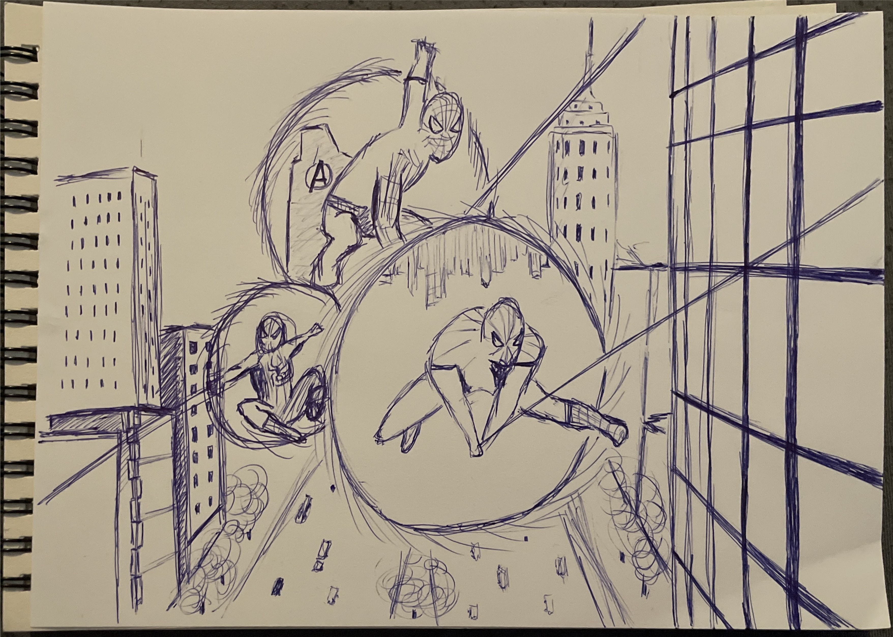
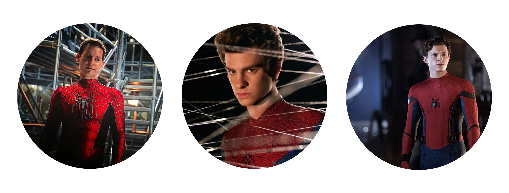
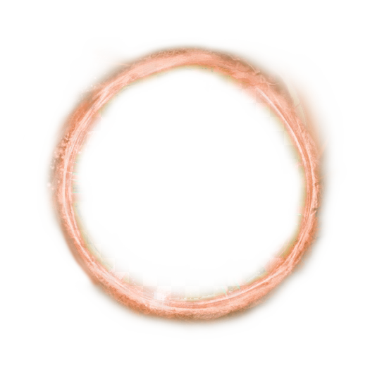
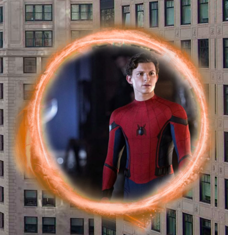

# Procesverslag
Markdown is een simpele manier om HTML te schrijven.  
Markdown cheat cheet: [Hulp bij het schrijven van Markdown](https://github.com/adam-p/markdown-here/wiki/Markdown-Cheatsheet).

Nb. De standaardstructuur en de spartaanse opmaak van de README.md zijn helemaal prima. Het gaat om de inhoud van je procesverslag. Besteedt de tijd voor pracht en praal aan je website.

Nb. Door *open* toe te voegen aan een *details* element kun je deze standaard open zetten. Fijn om dat steeds voor de relevante stuk(ken) te doen.

## Jij

### Ontwerper:
Delano Hehakaja

#### Je startniveau:
Mijn startniveau is: blauw

# Je plan

  
De eerste versie/schets van je ontwerp & je persoonlijke uitdaging

  ### De eerste versie/schets:
  

  ### Je ambitie: 
  Aan deze technieken/punten wil ik werken:
  - punt 1
  - punt 2
  - nog een punt
  - ...
 

## Voortgang/Feedback 1

  
Mijn bevindingen + wijzigingen (minimaal 5)

  ### Bevinding 1:
  Na de uitleg van het concept was het idee leuk en duidelijk en met de volgende afbeelding liet ik zien hoe dit eruit zou gaan zien.
  
  
  Als feedback kreeg ik de volgende punten:
  Ik zou per gateway een ander achtergrond weergeven, zodat je de verschillen kan zien
  Elk Spider-man heeft een ander outfit, laat dat ook terugkomen in je design
  

  #### oplossing:
  Beschrijving hoe je het hebt hebt opgelost of als het niet gelukt is hoe je het zou oplossen (tekst en afbeelding(en)).
  
  
  Ik heb 3 verschillende gateways gemaakt. Deze gateways laten verschillende achtergronden zien en de verschillende acteurs die Spider-man hebben gespeeld.

  ### Bevinding 2:
  Omschrijving van wat er nog niet orde was (tekst en afbeelding(en)).
  
  Wat nog ontbrak aan mijn ontwerp is dat de gateways nog niet op een multivers gateway leek. De eerste versie gateway was alleen een cirkel met een afbeelding erin.
  

  #### oplossing:
  Beschrijving hoe je het hebt hebt opgelost of als het niet gelukt is hoe je het zou oplossen (tekst en afbeelding(en)).
  
  Als oplossing heb ik op google een multivers gateway opgezocht, uitgesneden en boven op mijn huidige gateways verwerkt.
  
   

  ### Bevinding 3:
  Omschrijving van wat er nog niet orde was (tekst en afbeelding(en)).
  
  Er was nog geen omgeving waar de gateways in stonden.

   
  #### oplossing:
  Beschrijving hoe je het hebt hebt opgelost of als het niet gelukt is hoe je het zou oplossen (tekst en afbeelding(en)).
  
  Als ik aan Spider-man denk, dan denk ik aan New York. De stad waar Spider-man woont en misdaden bestrijdt. Dit wilde ik ook in mijn ontwerp verwerken. Ik heb een afbeelding gezocht van de stad New York om als achtergrond te gebruiken.
  
  
  
  
  
  ### Bevinding 4:
  Omschrijving van wat er nog niet orde was (tekst en afbeelding(en)).
  
  Bij de oplossing van bevinding 3 zie je bovenin wat tekst met standaard fonts. Deze fonts moeten natuurlijk wat meer sfeer krijgen, waardoor het bij de Spider-man sfeer gaat passen.

   
  #### oplossing:
  Beschrijving hoe je het hebt hebt opgelost of als het niet gelukt is hoe je het zou oplossen (tekst en afbeelding(en)).
  
  Door het lettertype en de kleur aan te passen, kom je al meer in de sfeer van Spider-man. Als extra toevoeging heb ik ook bovenin het logo van Marvel weergegeven, waardoor het nog duidelijker wordt dat het om Spider-man gaat.
  
  
  
  
  
  ### Bevinding 5:
  Omschrijving van wat er nog niet orde was (tekst en afbeelding(en)).
  
  Er moet nog interactie komen in het ontwerp.

   
  #### oplossing:
  Beschrijving hoe je het hebt hebt opgelost of als het niet gelukt is hoe je het zou oplossen (tekst en afbeelding(en)).
  
  Door middel van hoveren en klikken komt er interactie. Als je met je muis over 1 van de gateways gaat dan vergroot die gateway. Klik je vervolgens ook nog eens op de gateway dan verandert de afbeelding in de gateway naar de Spider-man en MJ.
  
  
  

## Voortgang/Feedback 2

  
Mijn bevindingen + wijzigingen (minimaal 5)

  
  ### Bevinding 1:
  Omschrijving van wat er nog niet orde was (tekst en afbeeding(en)).

  #### oplossing:
  Beschrijving hoe je het hebt hebt opgelost of als het niet gelukt is hoe je het zou oplossen (tekst en afbeeding(en)).

  ### Bevinding 2:
  Omschrijving van wat er nog niet orde was (tekst en afbeeding(en)).

  #### oplossing:
  Beschrijving hoe je het hebt hebt opgelost of als het niet gelukt is hoe je het zou oplossen (tekst en afbeeding(en)).

  ### Bevinding 3:
  ...

## Voortgang/Feedback 3

  
Mijn bevindingen + wijzigingen (minimaal 5)

  
  ### Bevinding 1:
  Omschrijving van wat er nog niet orde was (tekst en afbeeding(en)).

  #### oplossing:
  Beschrijving hoe je het hebt hebt opgelost of als het niet gelukt is hoe je het zou oplossen (tekst en afbeeding(en)).

  ### Bevinding 2:
  Omschrijving van wat er nog niet orde was (tekst en afbeeding(en)).

  #### oplossing:
  Beschrijving hoe je het hebt hebt opgelost of als het niet gelukt is hoe je het zou oplossen (tekst en afbeeding(en)).

  ### Bevinding 3:
  ...

## Reflectie

  
Mijn eindresultaat & persoonlijke ontwikkeling

  ### Je uitkomst - karakteristiek screenshot(s):
  

  ### Dit ging goed/Heb ik geleerd: 
  Korte omschrijving met plaatje(s)

  

  ### Dit was lastig/Is niet gelukt:
  Korte omschrijving met plaatje(s)

  

## Bronnenlijst

continu bijhouden terwijl je werkt

Nb. Wees specifiek ('css-tricks' als bron is bijv. niet specifiek genoeg).

1. bron 1
2. bron 2
3. ...

