# Procesverslag
Markdown is een simpele manier om HTML te schrijven.  
Markdown cheat cheet: [Hulp bij het schrijven van Markdown](https://github.com/adam-p/markdown-here/wiki/Markdown-Cheatsheet).

Nb. De standaardstructuur en de spartaanse opmaak van de README.md zijn helemaal prima. Het gaat om de inhoud van je procesverslag. Besteedt de tijd voor pracht en praal aan je website.

Nb. Door *open* toe te voegen aan een *details* element kun je deze standaard open zetten. Fijn om dat steeds voor de relevante stuk(ken) te doen.

## Jij

### Ontwerper:
Delano Hehakaja

#### Je startniveau:
Mijn startniveau is: blauw

# Je plan

  
De eerste versie/schets van je ontwerp & je persoonlijke uitdaging

  ### De eerste versie/schets:
  

  ### Je ambitie: 
  Aan deze technieken/punten wil ik werken:
  - Animeren zonder javascript
  - Responsive design maken
  - Content stijlen in css
 

## Voortgang/Feedback 1

  
Mijn bevindingen + wijzigingen

  ### Bevinding 1:
  Na de uitleg van het concept was het idee leuk en duidelijk en met de volgende afbeelding liet ik zien hoe dit eruit zou gaan zien.
  
  
  Als feedback kreeg ik de volgende punten:
  Ik zou per gateway een ander achtergrond weergeven, zodat je de verschillen kan zien
  Elk Spider-man heeft een ander outfit, laat dat ook terugkomen in je design
  

  #### oplossing:
  Beschrijving hoe je het hebt hebt opgelost of als het niet gelukt is hoe je het zou oplossen (tekst en afbeelding(en)).
  
  
  Ik heb 3 verschillende gateways gemaakt. Deze gateways laten verschillende achtergronden zien en de verschillende acteurs die Spider-man hebben gespeeld.

  ### Bevinding 2:
  Omschrijving van wat er nog niet orde was (tekst en afbeelding(en)).
  
  Wat nog ontbrak aan mijn ontwerp is dat de gateways nog niet op een multivers gateway leek. De eerste versie gateway was alleen een cirkel met een afbeelding erin.
  

  #### oplossing:
  Beschrijving hoe je het hebt hebt opgelost of als het niet gelukt is hoe je het zou oplossen (tekst en afbeelding(en)).
  
  Als oplossing heb ik op google een multivers gateway opgezocht, uitgesneden en boven op mijn huidige gateways verwerkt.
  
   

  ### Bevinding 3:
  Omschrijving van wat er nog niet orde was (tekst en afbeelding(en)).
  
  Er was nog geen omgeving waar de gateways in stonden.

   
  #### oplossing:
  Beschrijving hoe je het hebt hebt opgelost of als het niet gelukt is hoe je het zou oplossen (tekst en afbeelding(en)).
  
  Als ik aan Spider-man denk, dan denk ik aan New York. De stad waar Spider-man woont en misdaden bestrijdt. Dit wilde ik ook in mijn ontwerp verwerken. Ik heb een afbeelding gezocht van de stad New York om als achtergrond te gebruiken.
  
  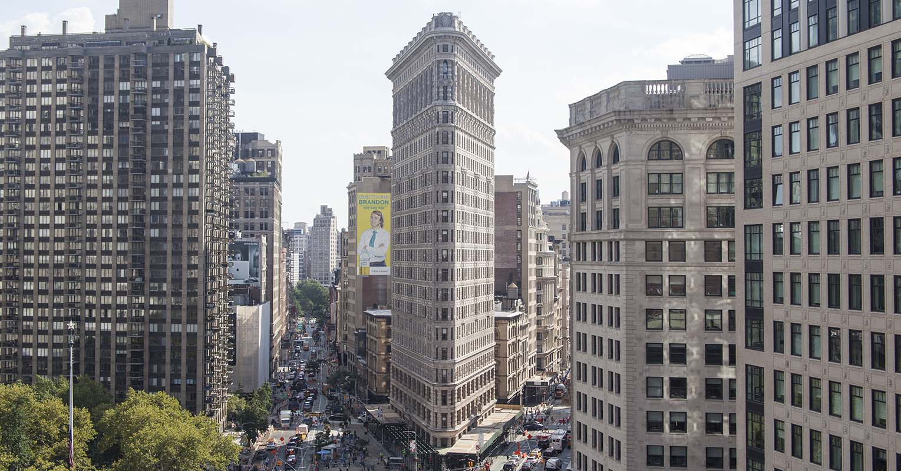
  
  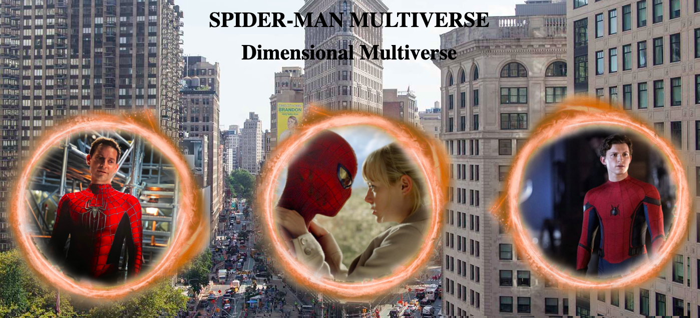
  
  ### Bevinding 4:
  Omschrijving van wat er nog niet orde was (tekst en afbeelding(en)).
  
  Bij de oplossing van bevinding 3 zie je bovenin wat tekst met standaard fonts. Deze fonts moeten natuurlijk wat meer sfeer krijgen, waardoor het bij de Spider-man sfeer gaat passen.

   
  #### oplossing:
  Beschrijving hoe je het hebt hebt opgelost of als het niet gelukt is hoe je het zou oplossen (tekst en afbeelding(en)).
  
  Door het lettertype en de kleur aan te passen, kom je al meer in de sfeer van Spider-man. Als extra toevoeging heb ik ook bovenin het logo van Marvel weergegeven, waardoor het nog duidelijker wordt dat het om Spider-man gaat.
  
  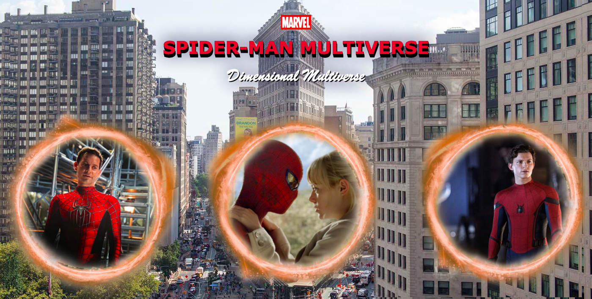
  
  Bronnen:
  https://codepen.io/The_Gusz/pen/mdXWbLw
  
  
  
  ### Bevinding 5:
  Omschrijving van wat er nog niet orde was (tekst en afbeelding(en)).
  
  Er moet nog interactie komen in het ontwerp.

   
  #### oplossing:
  Beschrijving hoe je het hebt hebt opgelost of als het niet gelukt is hoe je het zou oplossen (tekst en afbeelding(en)).
  
  Door middel van hoveren en klikken komt er interactie. Als je met je muis over 1 van de gateways gaat dan vergroot die gateway. Klik je vervolgens ook nog eens op de gateway dan verandert de afbeelding in de gateway naar de Spider-man en MJ.
  
  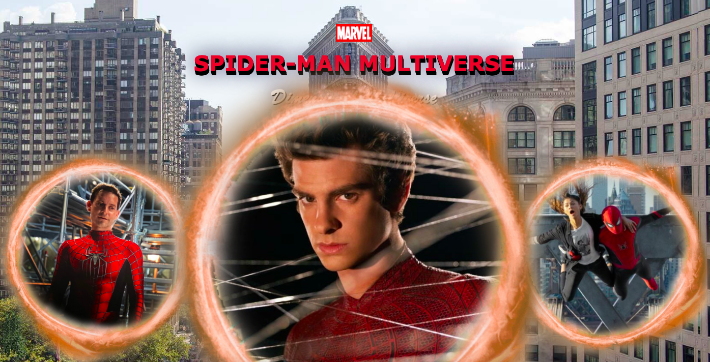
  
  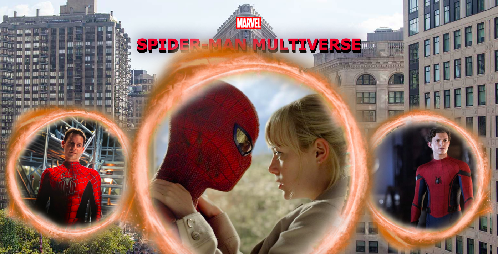
  
  Bronnen:
  https://codepen.io/The_Gusz/pen/MWQyWbG?editors=1100

## Voortgang/Feedback 2

  
Mijn bevindingen + wijzigingen

  
  ### Bevinding 1:
  Omschrijving van wat er nog niet orde was (tekst en afbeelding(en)).
  
  Op de pagina waren alleen de fonts responsive, maar de gateway's nog niet.

  #### oplossing:
  Beschrijving hoe je het hebt hebt opgelost of als het niet gelukt is hoe je het zou oplossen (tekst en afbeeding(en)).
  
  Door middel van de width aan te passen naar width: 22vw bij de buttons/gateway's, worden deze responsive.
  
  Groot scherm:
  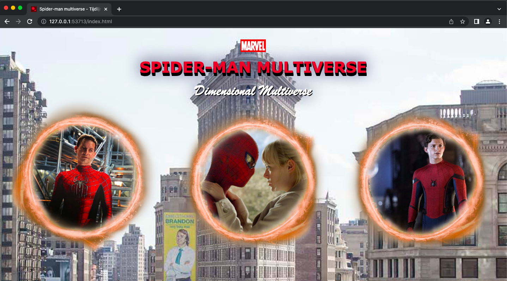
  
  Kleiner scherm:
  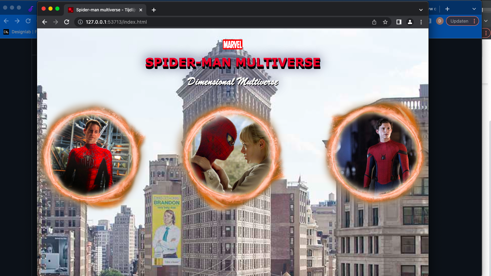

  ### Bevinding 2:
  Omschrijving van wat er nog niet orde was (tekst en afbeelding(en)).
  
  Ik moet nog duidelijker naar voren laten dat het gaat om 3 verschillende Spider-man's. 

  #### oplossing:
  Beschrijving hoe je het hebt hebt opgelost of als het niet gelukt is hoe je het zou oplossen (tekst en afbeeding(en)).
  
  Dit laat ik zien door een tekstbriefje omringd door een Spider-web. In dit tekstbriefje staat de naam van de acteur die in de gateway wordt afgebeeld en in welke Spider-man's hij heeft gespeeld.
  
  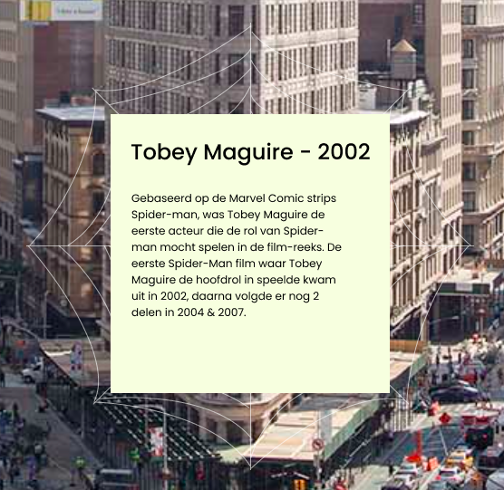

  ### Bevinding 3:
  Omschrijving van wat er nog niet orde was (tekst en afbeelding(en)).
  
  De custom properties moest nog toegepast worden voor elk lettertypekleur en achtergrond kleur.
  
  #### oplossing:
  Door middel van :root heb ik de kleuren benoemd en ben ik door heel mijn css code gegaan om het toe te passen.
  
  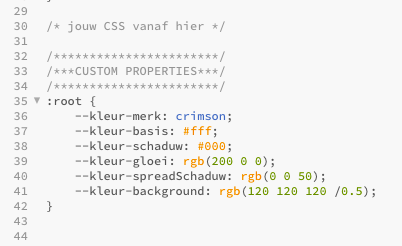

## Voortgang/Feedback 3

  
Mijn bevindingen + wijzigingen

  
  ### Bevinding 1:
  Omschrijving van wat er nog niet orde was (tekst en afbeelding(en)).
  
  Behalve de hover state ontbraken de rest van de states in mijn ontwerp. Dus moest er nog de focus en active states toegepast worden.

  #### oplossing:
  Beschrijving hoe je het hebt hebt opgelost of als het niet gelukt is hoe je het zou oplossen (tekst en afbeelding(en)).
  
  Voor de focus state heb ik een donkerblauw schaduw toegepast om te laten zien waar je bent.
  
  Geen focus
  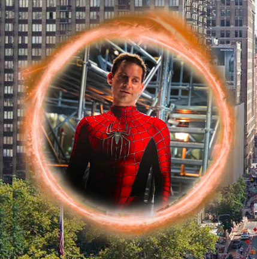
  
  Focus state
  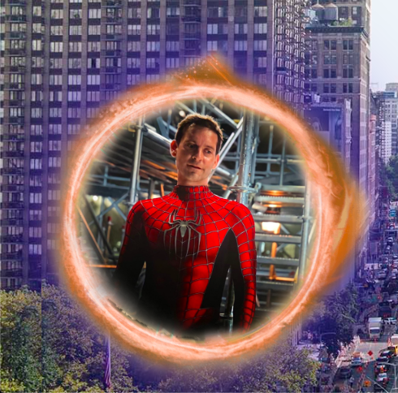
  
  Voor de active state heb ik de opacity verlaagd, dus wanneer je op de gateway klikt dan zie je vermindering in de opacity.
  
  Normaal
  
  
  Active state
  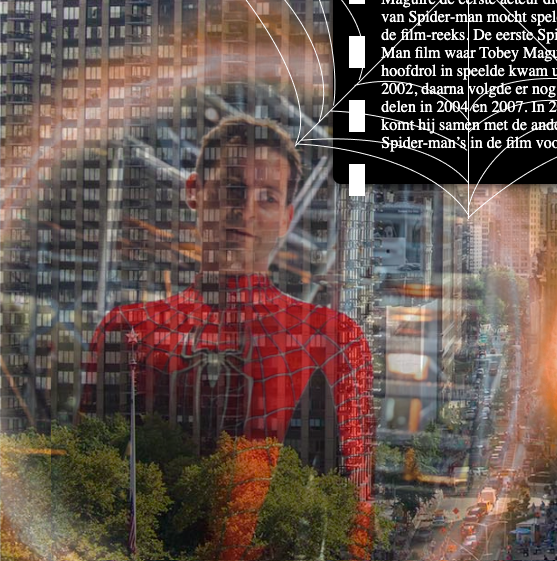
  

  ### Bevinding 2:
  Omschrijving van wat er nog niet orde was (tekst en afbeelding(en)).
  
  Het tekstvak stond nog onder de gateway's terwijl die links en rechtsboven de gateway's moeten staan.
  
  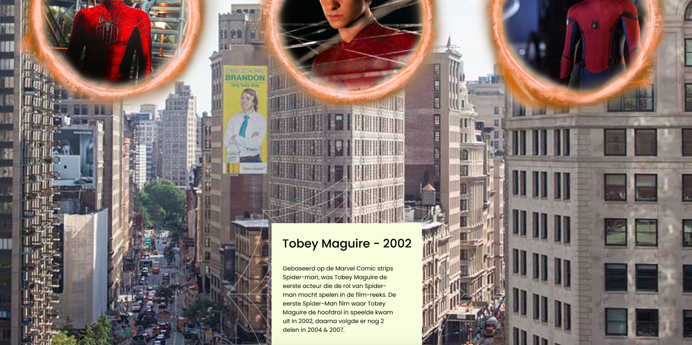

  #### oplossing:
  Beschrijving hoe je het hebt hebt opgelost of als het niet gelukt is hoe je het zou oplossen (tekst en afbeelding(en)).
  
  Ik had een afbeelding gebruikt en onder de andere li's gezet. Dit heb ik aangepast door een section toe te voegen bij elke li gateway. In de section plaatste ik tekst en door middel van css stijl ik de achtergrond. Om de tekst links en rechtsboven de gateway's te krijgen heb ik in css heel de section opgeroepen en op positie geplaatst.
  
  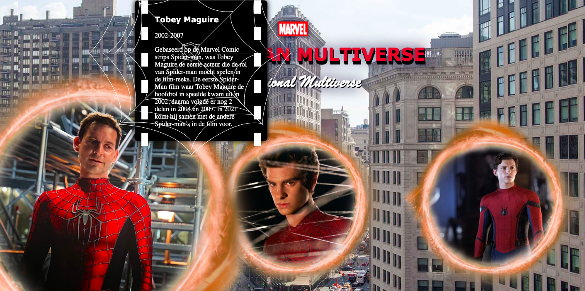

  ### Bevinding 3:
  Omschrijving van wat er nog niet orde was (tekst en afbeelding(en)).
  
  Bij de tekstvak heb ik een spider-web toegevoegd. Deze spider-web staat voor de tekstvak, maar die wil ik erachter hebben.
  
  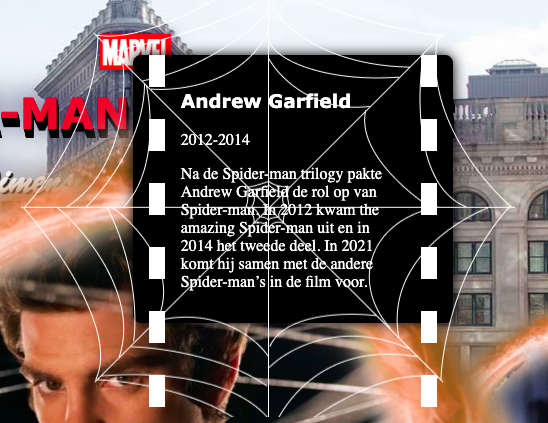
  
  #### oplossing:
  Beschrijving hoe je het hebt hebt opgelost of als het niet gelukt is hoe je het zou oplossen (tekst en afbeelding(en)).
  
  
  
  ### Bevinding 4:
  Omschrijving van wat er nog niet orde was (tekst en afbeelding(en)).
  
  Zoals je bij de vorige bevindingen kon zien was het tekstvak al verandert, maar heb ik die nog niet besproken. Ik vond het tekstvak niet bij het ontwerp passen.
  
  
  
  #### oplossing:
  Beschrijving hoe je het hebt hebt opgelost of als het niet gelukt is hoe je het zou oplossen (tekst en afbeelding(en)).
  
  Als oplossing heb ik er een filmrol gemaakt, omdat het ontwerp over verschillende Spider-man's gaat en over welke films het gaat.
  
  

## Reflectie

  
Mijn eindresultaat & persoonlijke ontwikkeling

  ### Je uitkomst - karakteristiek screenshot(s):
  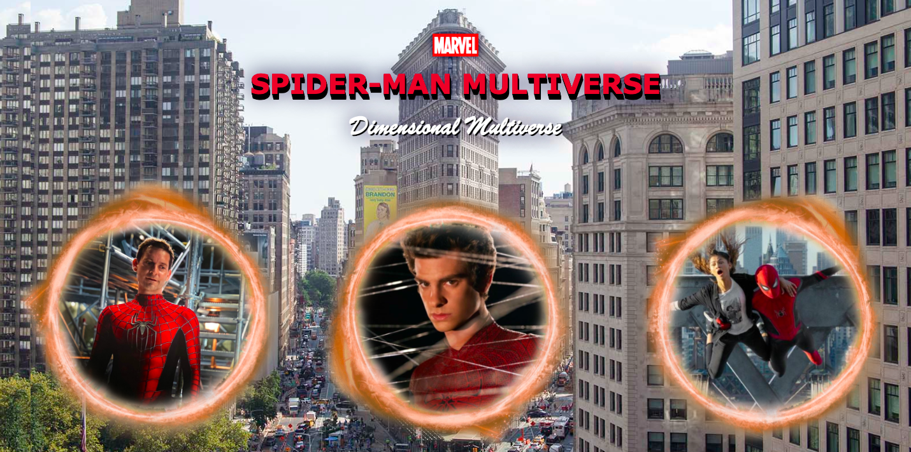
  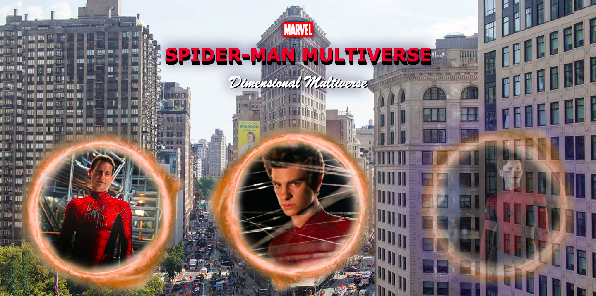
  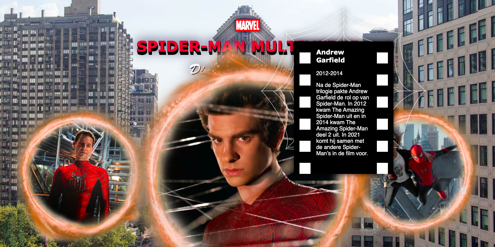
  

  ### Dit ging goed/Heb ik geleerd: 
  Korte omschrijving met plaatje(s)
  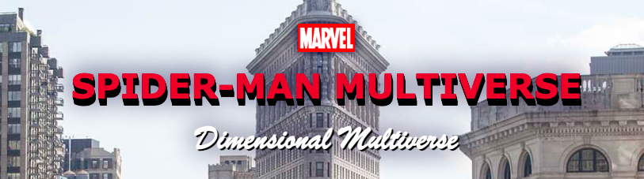

  ### Dit was lastig/Is niet gelukt:
  Korte omschrijving met plaatje(s)

  

## Bronnenlijst

continu bijhouden terwijl je werkt

Nb. Wees specifiek ('css-tricks' als bron is bijv. niet specifiek genoeg).

1. Afbeelding Spider-man Tobey Maguire; https://geektyrant.com/news/sam-raimi-would-not-direct-tom-hollands-spider-man-4-because-tobey-maguire-would-break-my-neck

2. Afbeelding Spider-man Andrew Garfield; https://www.koimoi.com/hollywood-news/spider-man-andrew-garfield-is-definitely-open-to-make-a-comeback-as-peter-parker-will-have-to-feel-very-sure-certain-in-myself/

3. Afbeelding Spider-man Tom Holland; https://www.hln.be/film/spider-man-tom-holland-stelt-fans-gerust-we-zullen-nieuwe-manieren-vinden-om-het-nog-cooler-te-maken~a5d86b95/?referrer=https%3A%2F%2Fwww.google.com%2F

4. Afbeelding Marvel logo; https://commons.wikimedia.org/wiki/File:Marvel-Comics-Logo.svg

5. Afbeelding achtergrond NYC; https://untappedcities.com/2019/03/29/10-of-nycs-triangle-buildings-a-brief-history/

6. Afbeelding Spider-man Tobey Maguire en MJ; http://begin-english.ru/stati-na-angliiskom/turns-out-there-was-no-cgi-in-that-tray-scene-in-spider-man

7. Afbeelding Spider-man Andrew Garfield en MJ; https://www.donnaglamour.it/wp-content/uploads/2020/02/FB_The_Amazing_Spider_Man.jpg

8. Afbeelding Spider-man Tom Holland en MJ; https://www.techadvisor.com/cmsdata/features/3811839/spider-man_post-credits_scene_thumb800.jpg

9. Afbeelding Portal; https://www.pngfind.com/pngs/m/245-2457907_portal-portal2-doctorstrange-doctor-strange-png-for-picsart.png

10. Ik heb gekeken naar hoe je een 3d tekst maakt met behulp van deze bron; https://codepen.io/The_Gusz/pen/mdXWbLw

11. Ik heb het hoveren en klikken op de gateway mogelijk gemaakt met behulp van deze bron: https://codepen.io/The_Gusz/pen/mdXWbLw

12. Afbeelding Spider-man icon; https://iconape.com/spider-man-comic-new-logo-logo-icon-svg-png.html

